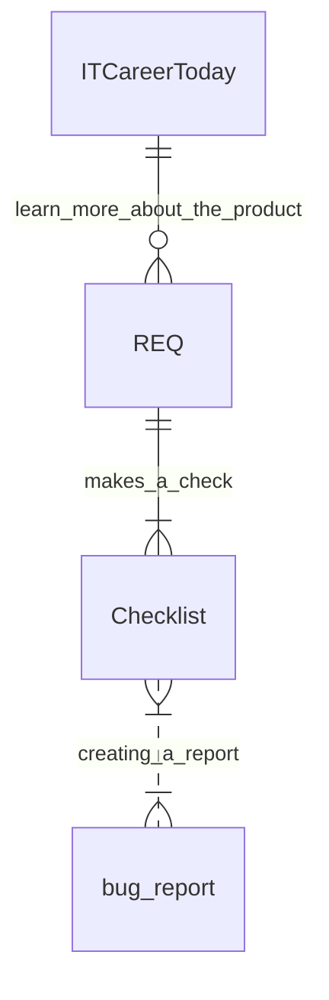

# *ITCareer - проверка формы*
1. ITCareerToday web form - [Тестируемая форма](http://itcareer.pythonanywhere.com/)
2. Checklist к форме [тут](https://github.com/JohnnyShwarts/number_29/blob/CheckLists/form%20Checklist.pdf)
3. Требования [тут](https://github.com/JohnnyShwarts/number_29/blob/Bag_Reports/Form_ITCareer.txt)
4. bug_report на [основании чек листа](https://github.com/JohnnyShwarts/number_29/blob/Bag_Reports/Bug_Reports.pdf)

